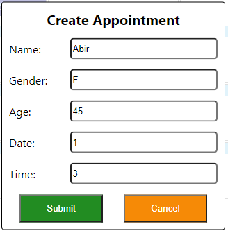
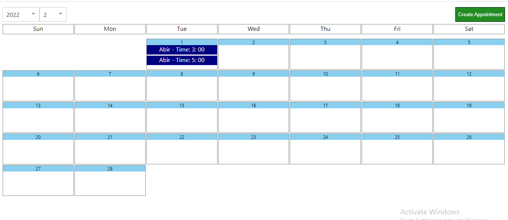

# React Calendar App

This is a calendar app, where you can set appointments.

## Getting started

You can view a live demo over at https://calendar-app-appointment.herokuapp.com/

To get the frontend running locally:
* Clone this repo
* **npm install** to install all req'd dependencies
* **npm start** to start the local server (this project uses create-react-app)
## Features

1. Clicking the **Create Appointment** button, You will be able to create an appointment on specific day and time.
    
2. After creating the appointment It will show in the calendar dashboard.
    
3. Data will be saved in local storage by using Redux Store.
4. Appointment data will be sorted by Time.
5. By using react router change the month and year of the calendar. example :- localhost/year/2022/month/2
6. Root url It will always contain the current month.

